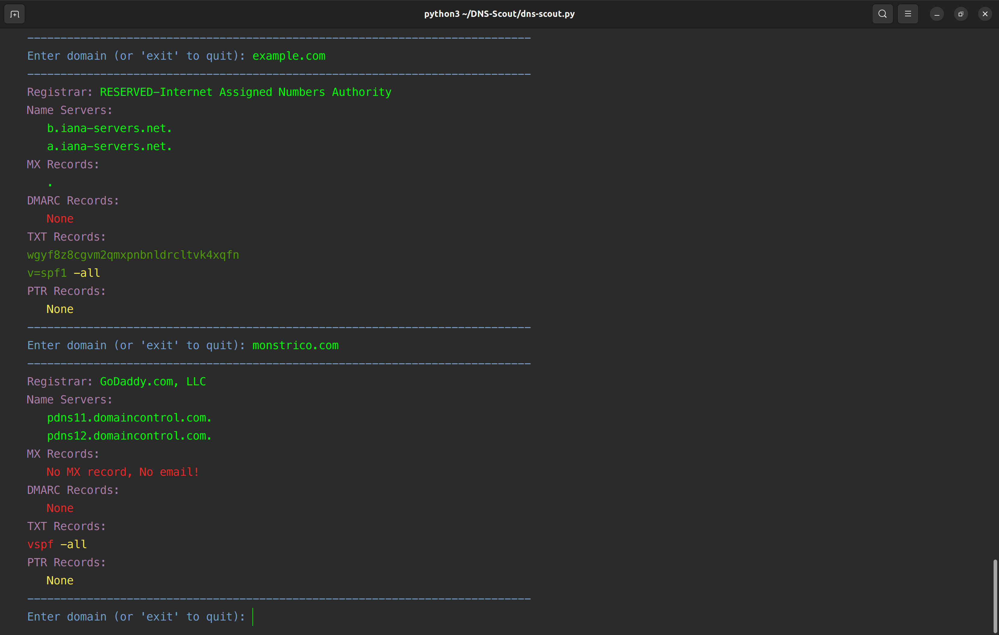

# DNS-Scout  

DNS Scout for Linux/MacOS pulls and displays DNS records in a color-coded console output that is **easy to see** and **copy/paste**.   
Registrar, NS, MX, SPF, DMARC, and PTR for easy DNS reconnaissance and troubleshooting.  
 
  

## Features:   

**Curated Output for Clarity:**  
 DNS Scout stands out by filtering out non-essential information, presenting users with a cleaner,  
 more focused view of the DNS data, and optimizing for clarity and relevance.  
 
**Enhanced Interactive CLI Interface:**  
 DNS Scout leverages ```readline``` to offer an advanced command-line interface  
 that's **easy to see and copy/paste**     
 **Session-based Memory Cycling**  
DNS Scout's interactive interface has a memory cycle feature, controlled by the up and down arrow keys.  
It helps navigate recent domain lookups for the session quickly.  
This feature is useful when conducting multiple lookups, and you need to refer to a previous entry.   
  
**Streamlined WHOIS Lookup:**
 DNS Scout efficiently parses domain registration data, presenting the user with concise registrar details and name servers, eliminating the clutter typically seen in raw WHOIS outputs.  
 
**Clear TXT Record Display:**   
 DNS Scout lists TXT records in an easily digestible format,  
 making tasks like SPF data or domain verification review more straightforward.  
 
**Registrar**   
**NS Name Servers**  
**MX Records**  
**Displays TXT Records**, useful for checking domain verification, SPF settings, etc.  
**DMARC Records**
**PTR**
**ASN**  
**Exact DNS data, no scrolling**      

### Installation Guide for DNS Scout  
  
#### Manual Nerd Install
Prerequisites: Go 1.21
For those who like to get their hands dirty:

1. **Download the Binary**:  
   Download the compiled binary for your operating system from the [Releases](https://github.com/careyjames/dns-scout/releases) page.

2. **Make It Executable**:  
   After downloading, navigate to the download directory and run:  
   ```chmod +x dns-scout```

3. **Move to PATH**:  
   Move the executable to a directory in your system's PATH. For example, you can move it to `/usr/local/bin` on a Unix-based system:  
   ```sudo mv dns-scout /usr/local/bin/```

4. **Run DNS Scout**:  
   Open a new terminal window and simply type `dns-scout` to start using the tool.

That's it! You've manually installed DNS-Scout like a true nerd.
 
 #### **Usage:**


