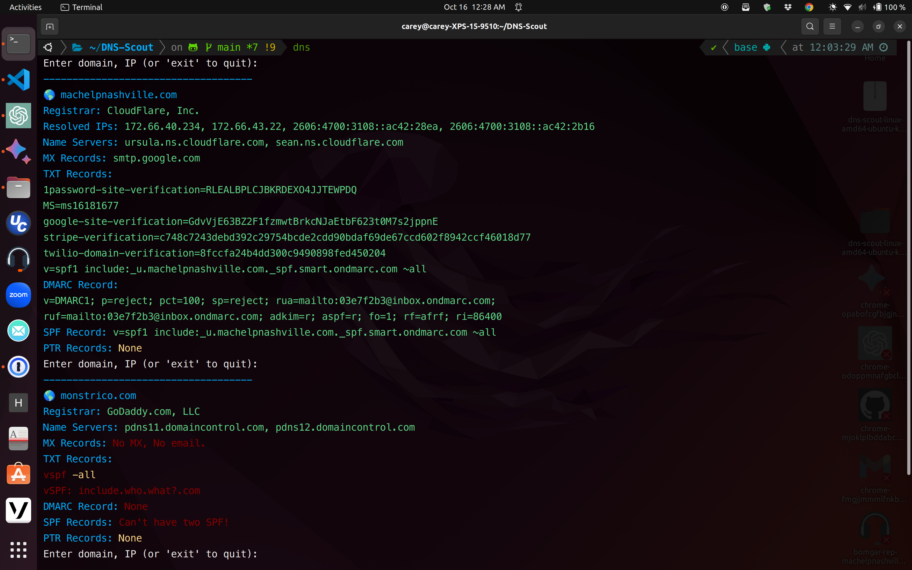
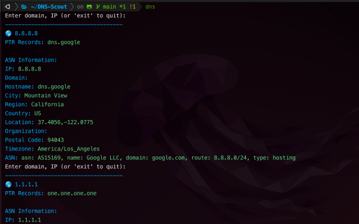
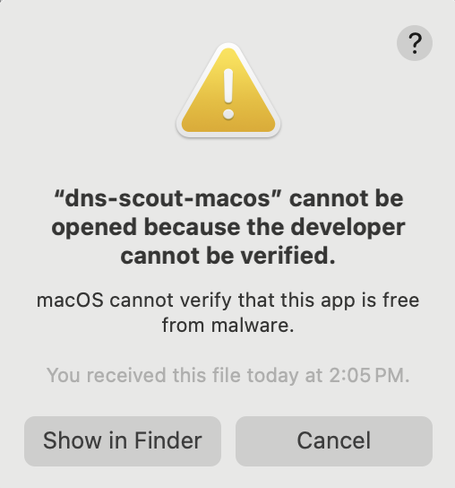
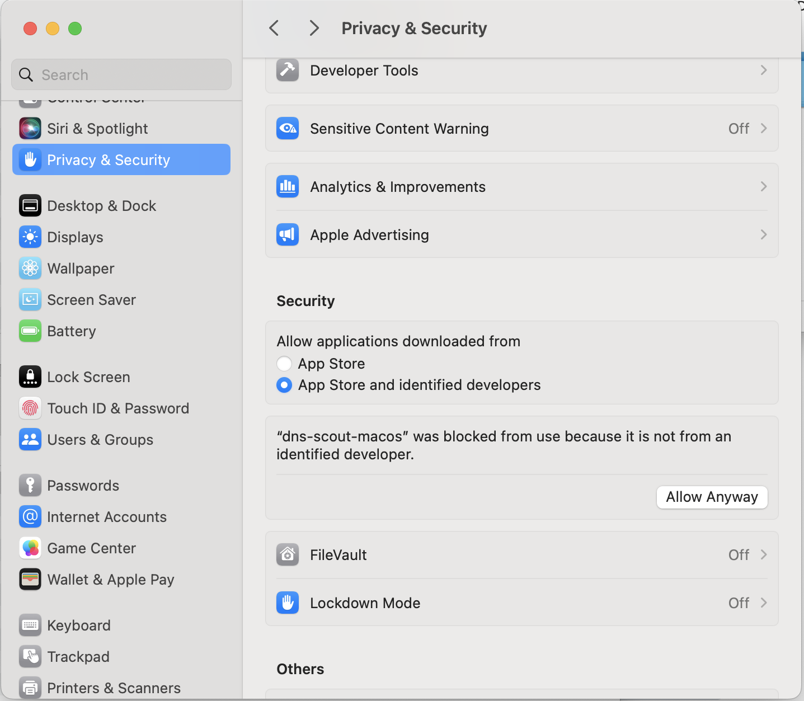

# DNS-Scout 🇺🇸 Carey James Balboa - Mac Help Nashville, Inc. 


[español](https://github.com/careyjames/DNS-Scout/blob/main/README(espa%C3%B1ol).md)

DNS Scout for Linux/MacOS pulls and displays DNS records in a color-coded console output that is **easy to see** and **copy/paste**.   
Registrar, NS, MX, SPF, DMARC, ASN and PTR for easy DNS reconnaissance and troubleshooting.  
 
   

  

## Features:   

**Curated Output for Clarity:**  
 DNS Scout stands out by filtering out non-essential information, presenting users with a cleaner,  
 more focused view of the DNS data, and optimizing for clarity and relevance.  
 
**Enhanced Interactive CLI Interface:**  
 DNS Scout leverages ```readline``` to offer an advanced command-line interface  
 that's **easy to see and copy/paste**     
 **Session-based Memory Cycling**  
DNS Scout's interactive interface has a memory cycle feature, controlled by the up and down arrow keys.  
It helps navigate recent lookups for the session quickly.  
This feature is useful when conducting multiple lookups, and you need to refer to a previous entry.   
  
**Streamlined WHOIS Lookup:**
 DNS Scout efficiently parses domain registration data, presenting the user with concise registrar details and name servers, eliminating the clutter typically seen in raw WHOIS outputs.  
 
**Clear TXT Record Display:**   
 DNS Scout lists TXT records in an easily digestible format,  
 making tasks like SPF or DMARC verification review more straightforward.  
 
**Registrar**   
**NS Name Servers**  
**MX Records**  
**Displays TXT Records**, useful for checking domain verification, SPF settings, etc.  
**DMARC Records**
**PTR**
**ASN**  
**Exact DNS data, no scrolling**      

### Installation Guide for DNS Scout  
  
#### Manual MacOS/Linux Nerd Install
Prerequisites: Go 1.21
For those who like to get their hands dirty:

1. **Download the Binary**:  
   Download the compiled binary for your operating system from the [Releases](https://github.com/careyjames/dns-scout/releases) page.

2. **Make It Executable**:  
   After downloading, navigate to the download directory and run:  
   ```chmod +x dns-scout-<version>``` (macos-silicon linux-amd64)

3. **Move to PATH**:  
   Move the executable to a directory in your system's PATH. For example, you can move it to `/usr/local/bin/` on a Unix-based system:  
   ```sudo mv dns-scout /usr/local/bin/```

4. **Get free or paid token from ipinfo.io**

5. **Run DNS Scout**:  
   Open a new terminal window and type `dns-scout` to start using the tool.

That's it! You've manually installed DNS-Scout like a true nerd.

**Here's a breakdown of how each method of storing the API token could be useful:**  

Environment Variable: Useful for users running the program in a controlled environment like a server,   
where setting environment variables is common practice.   
The ```/share/setup-api-token.sh``` script would be helpful for them.  
  
Command-Line Argument: Useful for those who wish to specify different API tokens for different runs without changing environment variables. It could be useful for testing.   

Stored in a File: Ideal for regular users who want to set the API token once and forget it. The token will be read from a file in the user's home directory, making it convenient for them. 

**If you are on MacOS**, go to System Settings > Security & Privacy and give ```dns-scout-<version>``` full disk permissions.   
  
 